# 🏏 Player Management System

## 📌 Project Description
Player Management System is a console-based project developed in C language. It helps manage player records using structures, functions.

## ✨ Features
-  Add Player
-  Remove Player
-  Search Player
-  Sort Player
-  Top 3 runs & WIckets
-  Update Player
-  Display All Players
-  Filters Players

## 🛠 Technologies Used
- C Language
- Structures
- Functions
- Dev C++

## ▶️ How to Run
1. Open the project in Dev C++.
2. Compile the source code.
3. Run the program.
4. Choose options from the menu.

## 📂 Project Modules
- Add Player
- Remove Player
- Search Player
- Update Player
- Display All Players

## 👨‍💻 Developer
**Ghanshyam Patil**

## 📸 Project Screenshots

### Main Menu
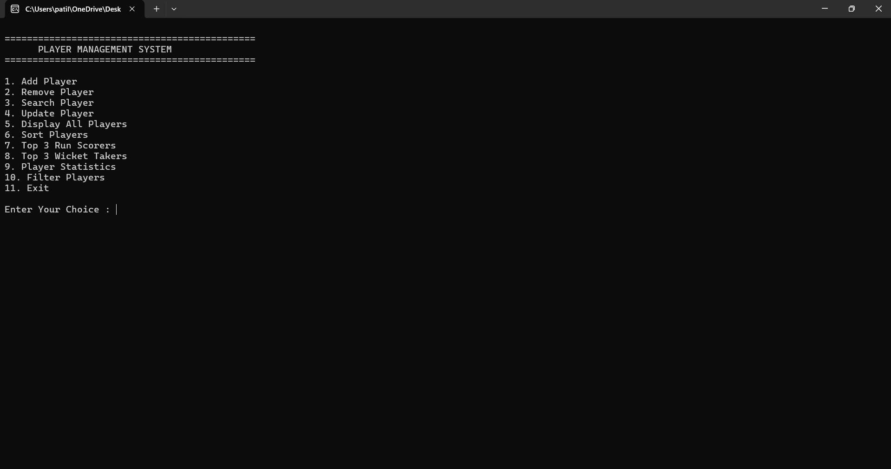

### Add Player
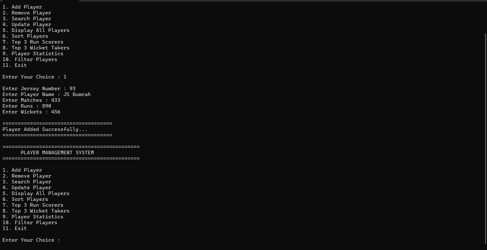

### Display Player
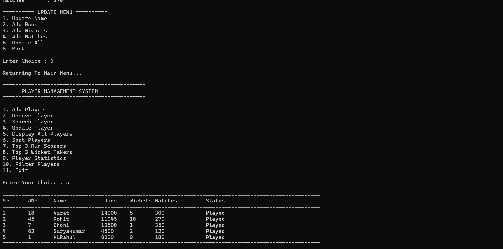

### Remove Player
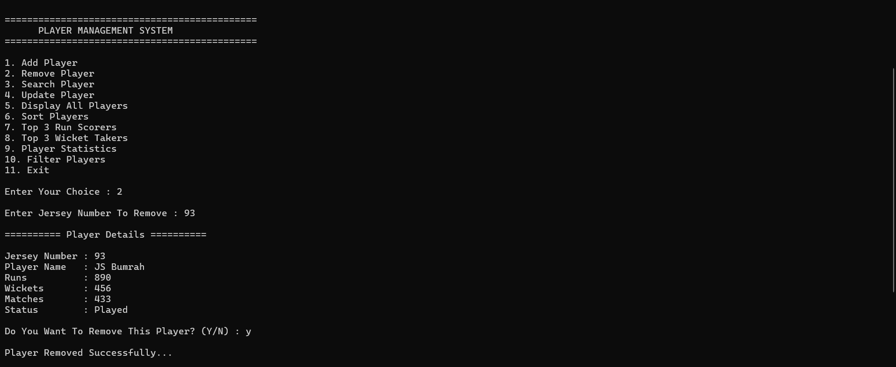

### Update Player
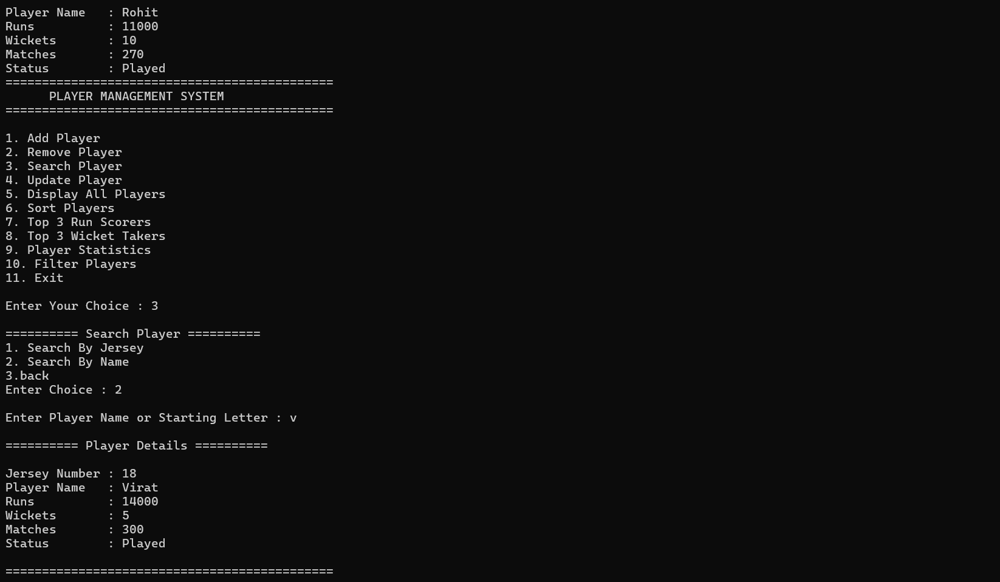

### Player Update Menu
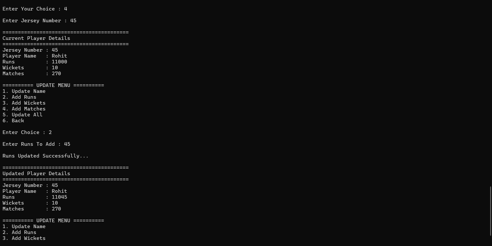

### Filter Players
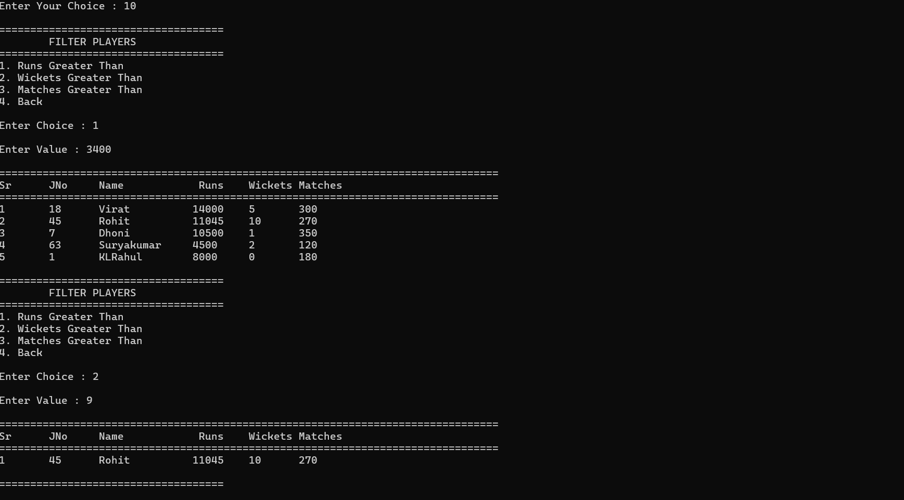

### Filter Players Menu
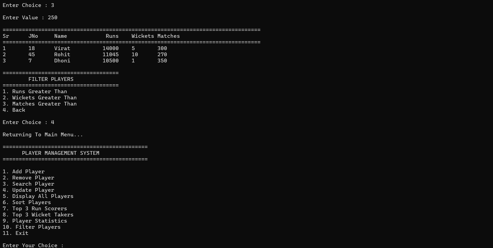

### Sort Menu
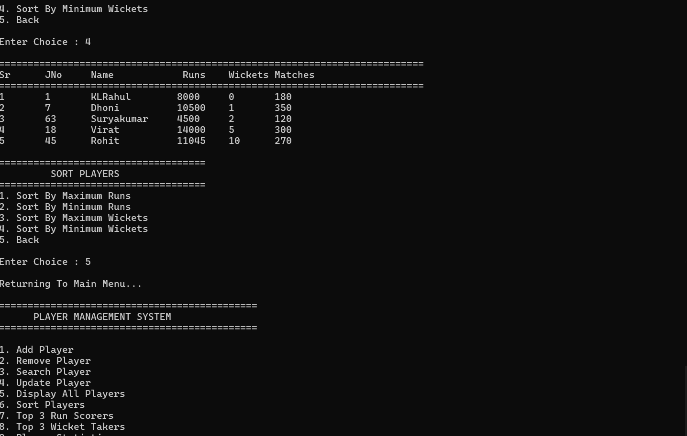

### Sort Player
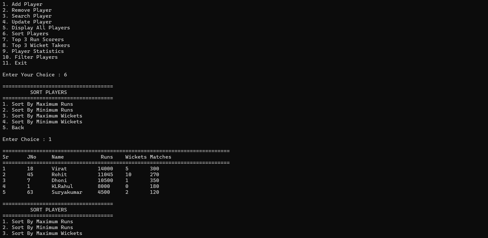

### Top 3 Runs & Wickets

### Exit
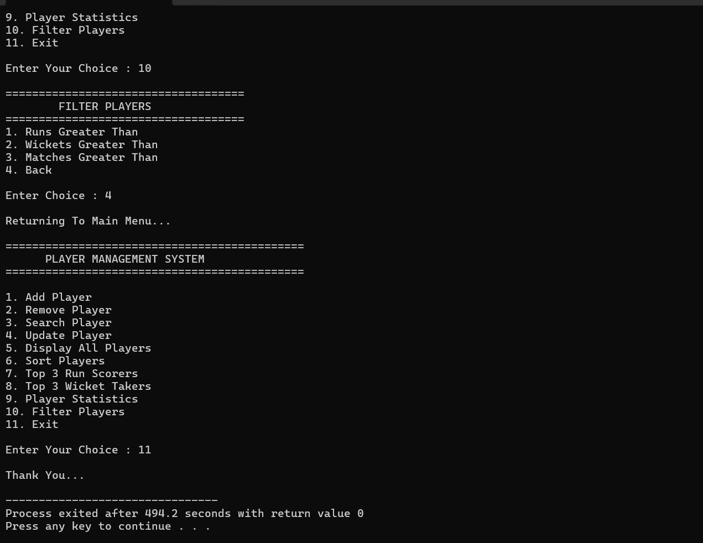
